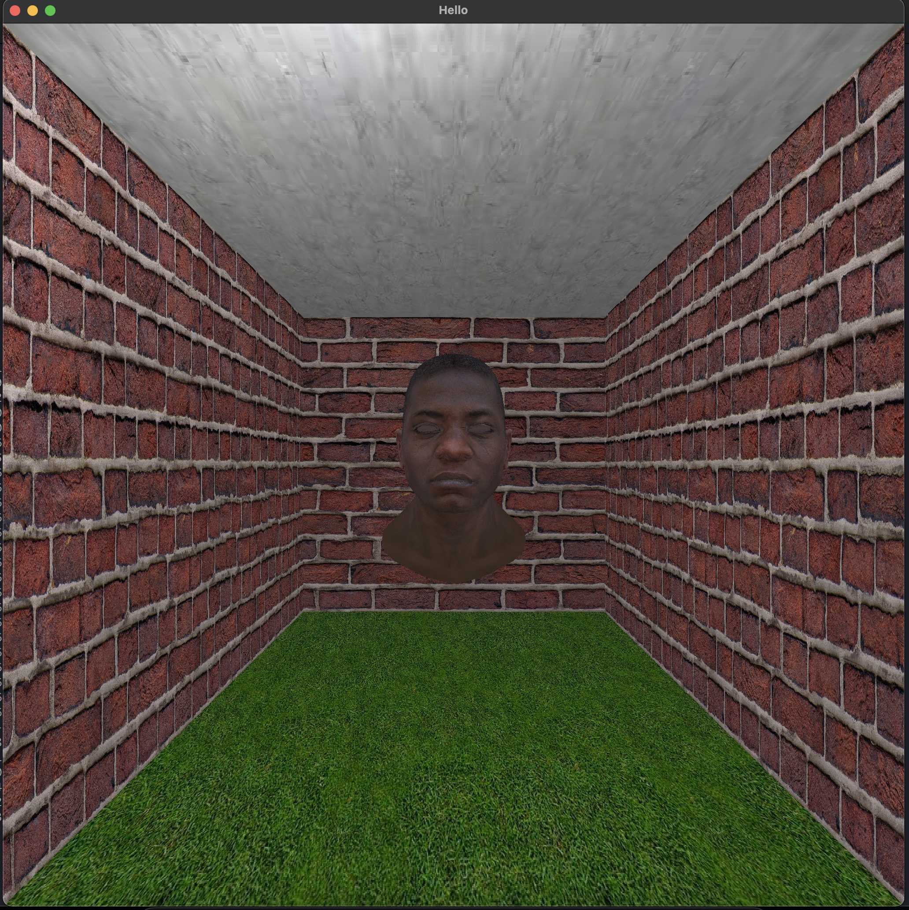

# Renderer

A simple real-time 3d renderer writen from scratch in go using a frame buffer. 

It supports perspective projection using an FPS camera, image textures, z-buffer and lights

### Usefull links

- https://fgiesen.wordpress.com/2013/02/10/optimizing-the-basic-rasterizer/
- https://chaosinmotion.com/2010/09/06/goodbye-far-clipping-plane/
- https://www.3dgep.com/understanding-the-view-matrix/
- https://www.reedbeta.com/blog/quadrilateral-interpolation-part-1/
- https://math.stackexchange.com/questions/13404/mapping-irregular-quadrilateral-to-a-rectangle
- https://www.scratchapixel.com/lessons/3d-basic-rendering/rasterization-practical-implementation/perspective-correct-interpolation-vertex-attributes
- https://machinethink.net/blog/3d-rendering-without-shaders/
- https://stackoverflow.com/questions/60910464/at-what-stage-is-clipping-performed-in-the-graphics-pipeline

- https://trenki2.github.io/blog/2017/06/15/developing-a-software-renderer-part3/
- https://github.com/Michaelangel007/game_dev_pdfs
- http://gameprogrammingpatterns.com/data-locality.html
- https://www.appentra.com/is-your-algorithm-running-at-peak-performance-the-roofline-model/

